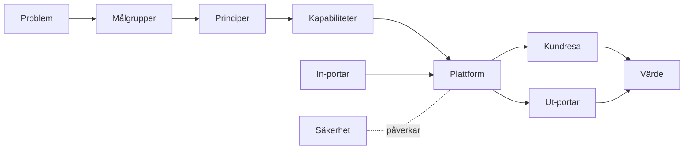
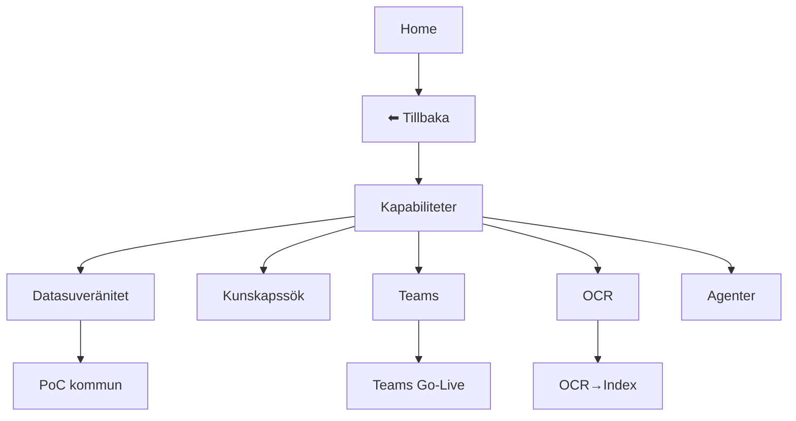

# Mermaid Styleguide – Leetpeek OS (v1)

Denna styleguide säkerställer att alla **diagram i Leetpeek OS** ser konsekventa ut, är läsbara och enkla att underhålla. Den gäller för **chart‑only‑UI**, max **3 nivåer** (L0→L1→L2) och **1–3 ord per nod**.

---

## 0) Snabb checklista (före du sparar en karta)
- [ ] 1–3 ord per nod (svenska).  
- [ ] 7–9 noder per karta (övrigt läggs i subgraph eller ny nivå).  
- [ ] L0 berättelse strikt **vänster→höger**; minimalt med korsande pilar.  
- [ ] **Home** och **⬅︎ Tillbaka** är noder i varje L1/L2.  
- [ ] **Säkerhet** visas som **spine** (egen nod/lane), inte pilar till allt.  
- [ ] Färger/klasser enligt denna guide.  
- [ ] `click`-länkar fungerar och pekar till rätt HTML.  

---

## 1) Initiera Mermaid (identisk på alla sidor)
Lägg i `<script>` efter `<div class="mermaid">` i varje HTML (ingår i vår boilerplate).

```html
<script>
  mermaid.initialize({
    startOnLoad: true,
    theme: "base",
    themeVariables: {
      fontFamily: "Inter, system-ui, sans-serif",
      fontSize: "14px",
      primaryColor: "#DAF0EE",
      primaryBorderColor: "#3B413C",
      primaryTextColor: "#0b0b0b",
      lineColor: "#3B413C",
      secondaryColor: "#94D1BE",
      tertiaryColor: "#66969B"
    },
    flowchart: { curve: "linear", htmlLabels: true, padding: 8, nodeSpacing: 60, rankSpacing: 60 }
  });
</script>
```

> **Tips:** `curve: "linear"` ger raka pilar. Öka `rankSpacing` om texten krockar.

---

## 2) Färger & klasser (klistra in i varje diagram)
Håll dig till **fyra huvudfärger** plus tre hjälparklasser.

```mermaid
%% --- Leetpeek brandklasser ---
classDef seg fill:#DAF0EE,stroke:#3B413C,color:#3B413C,stroke-width:2px;     %% Sektion/Översikt/Kundresa
classDef fund fill:#94D1BE,stroke:#3B413C,color:#0b0b0b,stroke-width:2px;     %% Principer/Värde
classDef cap  fill:#66969B,stroke:#3B413C,color:#ffffff,stroke-width:2px;     %% Kapabiliteter/Erbjudanden
classDef core fill:#DAF0EE,stroke:#3B413C,color:#0b0b0b,stroke-width:2px;     %% Plattform/Process/Playbook
classDef gov  fill:#3B413C,stroke:#3B413C,color:#ffffff,stroke-width:2px;     %% Säkerhet/Spine
classDef io   fill:#DAF0EE,stroke:#3B413C,color:#0b0b0b,stroke-width:2px;     %% In/Ut-portar
classDef val  fill:#94D1BE,stroke:#3B413C,color:#0b0b0b,stroke-width:2px;     %% Värde/KPI

%% --- Hjälparklasser ---
classDef decision fill:#ffffff,stroke:#3B413C,stroke-width:2px,stroke-dasharray:4 3;
classDef muted fill:#f4f6f7,stroke:#b0b6b8,color:#6b7377,stroke-width:1px;
classDef warn  fill:#fff3cd,stroke:#856404,color:#4d3b00,stroke-width:2px;
```

**Former & semantik**
- Rektangel = aktivitet/kapabilitet (standard `[Text]`).  
- Diamant = **beslut** (`{Beslut?}`) och ska ha två utgående pilar med etiketter `Ja/Nej`.  
- Start/Slut = rektanglar med `muted` respektive `val`. (Vi undviker specialformer för konsekvens.)

---

## 3) Text & etiketter
- 1–3 ord, undvik skiljetecken. Ex: `PoC kommun`, `Teams Go‑Live`, `OCR→Index`.  
- Radbryt sparsamt med `\n` eller `<br/>` (max två rader).  
- Använd svenska och enhetliga termer (ex. `Säkerhet`, inte `Security`).  
- Inga förkortningar som kräver förklaring på L0 (flytta till L1/L2).

---

## 4) L0, L1, L2 – mallar

### 4.1 L0 – Översikt


### 4.2 L1 – Kapabiliteter


### 4.3 L2 – Playbook (stage‑gate)
```mermaid
flowchart LR
  H[Home]:::muted --> B[⬅︎ Tillbaka]:::muted --> L[PoC kommun]:::seg

  subgraph F1[Förberedelse]:::core
    A1[Stakeholders]:::core --> A2[Datakartor]:::core --> A3[Säkerhet]:::core
  end
  L --> F1 --> D1{Go?}:::decision

  subgraph F2[Installation]:::core
    B1[On‑prem]:::core --> B2[Index]:::core --> B3[Teams pilot]:::core
  end
  D1 -->|Ja| F2 --> D2{OK?}:::decision

  subgraph F3[Test & QC]:::core
    C1[Funktion]:::core --> C2[Användare]:::core --> C3[Compliance]:::core
  end
  D2 -->|Ja| F3 --> R[Resultat]:::val
  D1 -->|Nej| X[Stopp]:::muted
  D2 -->|Nej| X
```

### 4.4 L2 – Pipeline (OCR→Index)
```mermaid
flowchart TB
  H[Home]:::muted --> B[⬅︎ Tillbaka]:::muted --> L[OCR→Index]:::seg
  subgraph O[OCR]:::core
    O1[Läs PDF]:::core --> O2[Extrahera]:::core --> O3[Klar]:::val
  end
  L --> O --> T1[Text]:::muted
  subgraph C[Chunk]:::core
    C1[Analys]:::core --> C2[Dela]:::core --> C3[Validera]:::core
  end
  T1 --> C --> T2[Chunks]:::muted
  subgraph E[Embed]:::core
    E1[Batch]:::core --> E2[Vektorer]:::core --> E3[Spara]:::core
  end
  T2 --> E --> T3[Vektorer]:::muted
  subgraph Q[QC]:::core
    Q1[Sampling]:::core --> Q2[Bedöm]:::core --> Q3[Rapport]:::core
  end
  T3 --> Q --> R[Klar]:::val
```

---

## 5) Linjer, etiketter & `linkStyle`
- Standard: `A --> B`  
- Med etikett (1–2 ord): `A -->|Ja| B`  
- Dämpa sekundär länk:  
  ```mermaid
  linkStyle 1 stroke:#b0b6b8,stroke-dasharray:3 3;
  ```

---

## 6) Subgraphs (faser, spår & portar)
- Använd subgraphs för **faser** (F1, F2, F3) eller **parallella spår**.  
- Du kan ge subgraphen stil:
  ```mermaid
  style F1 fill:#f9fbfb,stroke:#3B413C,stroke-width:1px;
  ```

---

## 7) Navigation med `click`
```mermaid
click NODE_ID "/l1/kapabiliteter.html" "Öppna" _self
```
- **Home** pekar alltid på `/index.html`.  
- **⬅︎ Tillbaka** pekar på överliggande nivå.  
- Skriv sökvägar **relativt** filens plats (L1 → `/index.html`, L2 → `/l1/...`).

---

## 8) Namn & filer
- Filnamn utan å/ä/ö: `sakerhet.html`, `inportar.html`.  
- Node‑ID rekommendation: `LP-L0-…`, `LP-L1-…`, `LP-L2-…`.  
- Undvik emoji i ID, men okej i etikett om de är mycket sparsamma.

---

## 9) Lint‑idéer (för Claude Code att auto‑kolla)
- **1–3 ord/etikett:** räkna ord i varje label (regex: `\[[^\]]+\]|\{[^\}]+\}` → dela på blanksteg/specialtecken). Flagg om >3.  
- **Nodantal:** räkna antalet `]` och `}` minus subgraph-rubriker. Flagg om >9 på samma nivå.  
- **Home/Back:** kontrollera att noder `Home` och `⬅︎ Tillbaka` finns i alla L1/L2.  
- **Click‑täckning:** varje “huvudnod” i L0 ska ha en `click`‑rad.  
- **Filnamn:** flagga å/ä/ö i sökvägar.

---

## 10) Utskrift & mobil
- Testa **PDF/A3**: labels ska vara läsbara på 100% zoom.  
- Mobil: diagram får scrollas horisontellt; undvik att text bryter utanför noder.

Med denna guide blir varje karta i **Leetpeek OS** konsistent, lätt att förstå och enkel att växa med.
