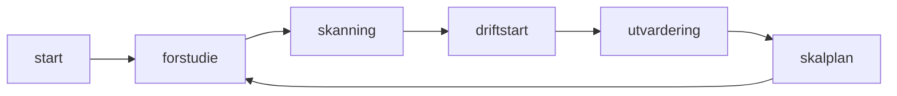

# Piteå-pilot

> **Urgency:** finansiering måste säkras senast 10 sep 2025 för att undvika förseningar.

## Steg
1. Förstudie
2. Skanning
3. Driftstart
4. Utvärdering
5. Skalplan

## Finansiering

| Källa | Stödnivå | Deadline |
|-------|----------|----------|
| Vinnova | 70% | 10 sep 2025 |
| Piteå kommun | 30% | 16 sep 2025 |

## Förstudie {#forstudie}
Inledande behovsanalys och kravinsamling.

## Skanning {#skanning}
Insamling av dokument och datakällor.

## Driftstart {#driftstart}
Produktionssättning av systemet.

## Utvärdering {#utvardering}
Mätning av resultat och lärdomar.

## Skalplan {#skalplan}
Plan för expansion efter pilot.
