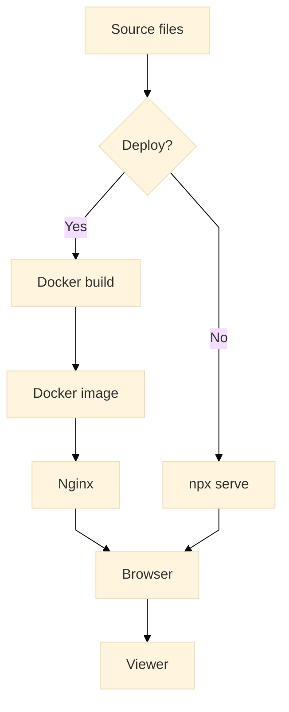

# LeetpeekOS version 2

This repository hosts the static Leetpeek OS knowledge base.

## Deploy with Docker

Build the image and serve the site with Nginx:

```bash
docker build -t leetpeekos .
docker run --rm -p 8080:80 leetpeekos
```

Open [http://localhost:8080](http://localhost:8080) to view the site.

## Local development

From the `LeetpeekOS_kunskapsbas` directory you can start a simple static server:

```bash
npm start
```

This uses `npx serve` to preview the site locally.

## How it works

The diagram below uses Mermaid v10.9 to show how deployment and local development paths converge to the same static site.



Both Docker and local development routes serve the same content to the viewer.
